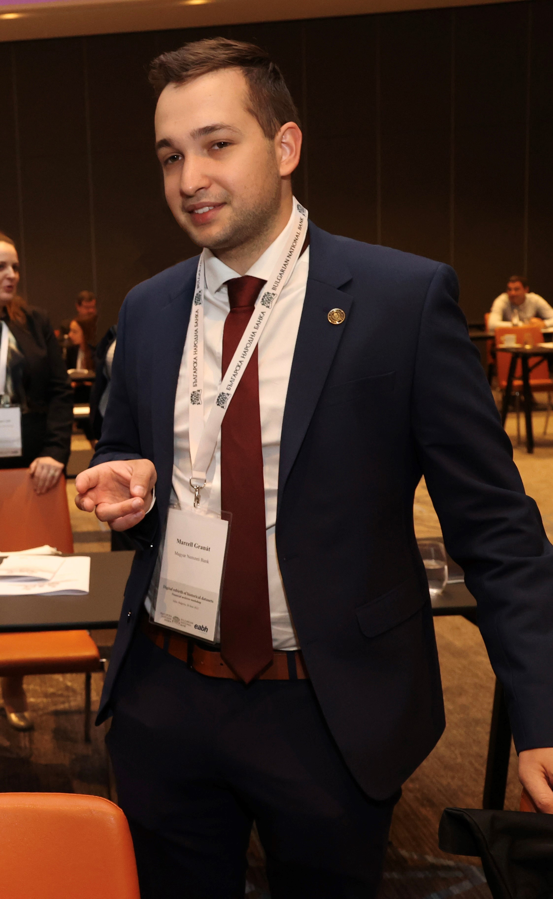

Aside
================================================================================

Contact Info {#contact}
--------------------------------------------------------------------------------

- <i class="fa fa-envelope"></i> granatcellmar98@gmail.com
- <i class="fa fa-github"></i> [github.com/marcellgranat](https://github.com/marcellgranat)
- For more information, please contact me via email.

Skills {#skills}
--------------------------------------------------------------------------------

- Experienced in statistical analysis, econometrics, machine learning, economics and research.

- Full experience with R programming.

- Highly skilled in Microsoft Excel, PowerPoint, Excel and VBA

Disclaimer {#disclaimer}
--------------------------------------------------------------------------------

Last updated on `r Sys.Date()`.

Main
================================================================================

Marcell Granat {#title}
--------------------------------------------------------------------------------

### Currently working as a researcher and participating in PhD programme

Motivated and responsible Data Analyst with significant experience in increasing comprehension of
reports, studies and presentations. Beside my studies at the University I took part actively in research and teaching projects. Thanks to lecturing statistical courses for years, I am confident in any conventional or innovative Data Analysis project, like standard econometrics or natural language processing. Also, I am very proud of my knowledge in R language.

Professional Experience {data-icon=suitcase}
--------------------------------------------------------------------------------

### Research and Education Expert (Current position)

Central Bank of Hungary MNB

Budapest

2022 February - 

- Academic research papers in financial econometrics.
- Took part at national and international conferences.

### Teaching Assistant (Current position)

John von Neumann University

Kecskemét

2022 \ August \ - 

(part-time)

- Academic research papers in econometrics and statistical modeling.
- Subject manager of Big Data course
- Lecturer

### Professional Proofreader

Makronóm Institute

Budapest

2022 January - 2022 May

(part-time)

- Approval and improvement of professional data analyses about current economic topics (e.g. Energy crisis, Tourism)

### Data Analyst

Makronóm Institute

Budapest

2021 May - 2022 January

- Instant data analyses for the Ministry of Innovation.
- Wrote Shiny (R) app demos.
- Converted statistical tutorials from SPSS to R language.

My job included empirical analysis, managing a financial measure databases (CREFO, ORBIS), and developing related applications (Shiny). Two major projects took place with the contribution of my
work: Sector 1000 and Inclusive Growth Index.

Education {data-icon=graduation-cap data-concise=true}
--------------------------------------------------------------------------------

### Eötvös Loránd University

PhD in Economics

Budapest

2022 -

Research field: Asset pricing and inflation forecast (FaVAR)

### Corvinus University of Budapest

MSc in Economic Analysis

Budapest

2022

Thesis: Empirical analysis of Hungarian Household Consumption: Application of Multivariate Adaptive Regression Splines

### Corvinus University of Budapest

BSc in Applied Economics

Budapest

2020

Thesis: The relationship among fertility rate, gross output per capita and unemployment (panel models, VAR models)

Teaching Experience {data-icon=chalkboard-teacher}
--------------------------------------------------------------------------------

### Data Analysis

Instructor of R, data visualization and statistics for foreign master Students.

Corvinus

2020-2022

### Econometrics

Teaching cross-section econometrics and R basics for undergraduate students.

Corvinus

2019-2021

### Statistics

Teaching descriptive statistics and inferential statistics for undergraduate students.

Corvinus

2019-2021

Research Experience {data-icon=laptop}
--------------------------------------------------------------------------------

**...**