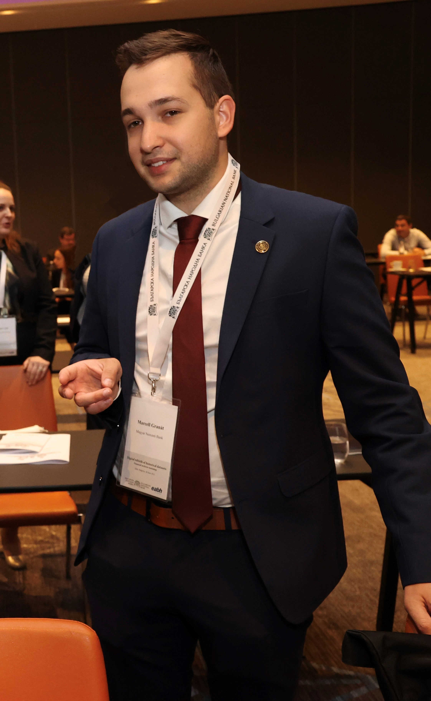

# Aside

<!--  -->

## Contact Info {#contact}

-   <i class="fa fa-envelope"></i> [E-mail](mailto:granat.marcell@nje.hu){.email}
-   <i class="fa fa-globe"></i> [Website](https://marcellgranat.com)
-   <i class="fa fa-github"></i> [GitHub](https://github.com/marcellgranat)
-   <i class="fa fa-linkedin"></i> [LinkedIn](www.linkedin.com/in/granatmarcell)
-   For more information, please contact me via email.

## Skills {#skills}

-   Experienced in statistical analysis, econometrics, machine learning, economics and research.

-   Full experience with **R and Python programming**. Intermediate level in Julia.

-   Highly skilled in PowerPoint, Excel and VBA.

## Disclaimer {#disclaimer}

# Main

## Marcell Granat {#title}

### Currently working as a researcher and participating in PhD programme

Motivated and responsible Data Analyst with significant experience in increasing comprehension of reports, studies and presentations. Beside my studies at the University, I took part actively in research and teaching projects. Thanks to lecturing statistical courses for years, I am confident in wide variaty of any conventional or innovative Data Analysis project, like standard econometrics or natural language processing.

## Professional Experience {data-icon="suitcase"}

### Economist

Central Bank of Hungary MNB

Budapest

2024 May -

-   Academic research on the field of economic history.

### Research and Education Expert

Central Bank of Hungary MNB

Budapest

2022 February - 2024 May

-   Academic research papers in financial econometrics.

### Teaching Assistant (Current position)

John von Neumann University / Metropolitan University

Kecskemét/Budapest

2022 August -

(part-time)

-   Academic research papers in econometrics and statistical modelling
-   Subject manager of Big Data & Data Visualisation course
-   Lecturer
-   TDK (Student Scientific Conference) secretary

### Professional Proofreader

Makronóm Institute

Budapest

2022 January - 2022 May

(part-time)

-   Approval and improvement of professional data analysis about current economic topics (e.g. energy crisis, tourism).

### Data Analyst

Makronóm Institute

Budapest

2021 May - 2022 January

-   Instant data analysis for the Ministry of Innovation.
-   Wrote Shiny (R) app demos.
-   Converted statistical tutorials from STATA to R language.

My job included empirical analysis, managing balance sheet databases (CREFO, ORBIS), and developing related applications (Shiny). Two major projects took place with the contribution of my work: Sector 1000 (managing and analyzing *interviews* with company managers) and Inclusive Growth Index (*Structural Equations Modelling* and *factor analyzing*).

## Publications {data-icon="laptop"}

### The Impact of AI on Hungary’s Labour Market: Evidence from Job Ads

[Conference: Impact of Artificial Intelligence on
the Macroeconomy and Monetary Policy](https://www.bde.es/f/webbe/INF/MenuHorizontal/SobreElBanco/Conferencias/2024/241024_AI_in_Macro_programme.pdf)

N/A

2024

### Expect the unexpected: Did the equity markets anticipate the Russo-Ukrainian war?

[Finance Research Letters](https://www.sciencedirect.com/science/article/pii/S1544612323006736)

N/A

2023

### An Empirical Analysis of the Predictive Power of European Yield Curves

[Financial and Economic Review](https://en-hitelintezetiszemle.mnb.hu/letoltes/fer-22-3-st2-granat-neszveda-szabo.pdf)

N/A

2023

### Digitalisation and business performance - focusing on Hungarian manufacturing firms

[Economic Review](http://www.kszemle.hu/tartalom/cikk.php?id=2100)

N/A

2023

### Media Attention to Environmental Issues and ESG Investing

[Financial and Economic Review](https://en-hitelintezetiszemle.mnb.hu/letoltes/fer-21-4-st5-csillag-granat-neszveda.pdf)

N/A

2022

### Empirical investigation of the recession forecasting ability of European yield curves

[Best paper](https://www.marcellgranat.com/posts/tdk-best-paper/) award at Corvinus Scientific Student Conference. Currently in press at Financial and Economic Review.

N/A

2021

## Awards {data-icon="award"}

### Winners of the global data science competition organised by Whiteshield.

Our public [GitHub repository](https://www.marcellgranat.com/blog/whiteshield/) is available.

Dubai

2023

### 2nd place at Quant Challenge organised by Morgan Stanley.

[Essay](https://www.marcellgranat.com/posts/morgan/), [slide](https://www.marcellgranat.com/posts/morgan2/) and [codes](https://github.com/MarcellGranat/MorganStanley-QuantChallenge) are available.

N/A

2023

### Winners of the data science competition organized by Hungarian Statistical Office.

[TV interview](https://www.marcellgranat.com/blog/statwars/) available.

N/A

2022

### 5x Winner at Corvinus Scientific Student Conference.

Some of the winning papers (others are in publication process in academic journals, thus I did not make them public):

N/A

2018-2022

##### [An Analysis of Customer Reviews of the Airbnb online platform](https://marcellgranat.github.io/airbnb-research/) (English)

##### [Empirical investigation of the recession forecasting ability of European yield curves](https://marcellgranat.github.io/yieldcurve/) (Hungarian)

### Special award at National Scientific Student Conference

[The trend of fertility rates and the related soci-economic changes in Hungary](https://marcellgranat.github.io/FertilityHUN)

N/A

2021

### Winner of the New Future scientific research competition (Demography section) organized by the National Bank of Hungary

[The relationship between the fertility rate and gross output per capita and unemployment](https://marcellgranat.github.io/ujdemografiaiprogram/)

N/A

2020

## Teaching Experience {data-icon="chalkboard-teacher"}

### Big Data and Data Visualisation

Lecturing master students for R programming and statistics. [Website](https://marcellgranat.com/bigdata) is available.

John von Neumann University

2023

### Data Analysis

Instructor of R, data visualization and statistics for foreign master students. [Coursebook](https://marcellgranat.github.io/Data-Analysis/) available.

Corvinus

2020-2022

### Econometrics

Teaching cross-section econometrics and R basics for undergraduate students.

Corvinus

2019-2021

### Statistics

Teaching descriptive statistics and inferential statistics for undergraduate students.

Corvinus

2019-2021

### History and civics 

Voluntery teaching high schools students through [Studium Generale](https://www.studiumgenerale.hu/) student organization.

Corvinus

2017-2022

## Education {data-icon="graduation-cap" data-concise="true"}

### Eötvös Loránd University

PhD in Economics

Budapest

2022 -

Research field: Asset pricing and inflation forecast

### Corvinus University of Budapest

MSc in Economic Analysis

Budapest

2022

Thesis: Empirical analysis of Hungarian Household Consumption: Application of Multivariate Adaptive Regression Splines

Thesis: Empirical analysis of Hungarian Household Consumption: Application of Multivariate Adaptive Regression Splines

### Corvinus University of Budapest

BSc in Applied Economics

Budapest

2020

Thesis: The relationship among fertility rate, gross output per capita and unemployment (panel models, VAR models)

### Erasmus University Rotterdam

Exchange program (3 months).

Rotterdam

2019

### Fudan University

Summer school program with scholarship provided by the National Bank of Hungary.

Shanghai

2019

##

Last updated on 2025-01-13.

